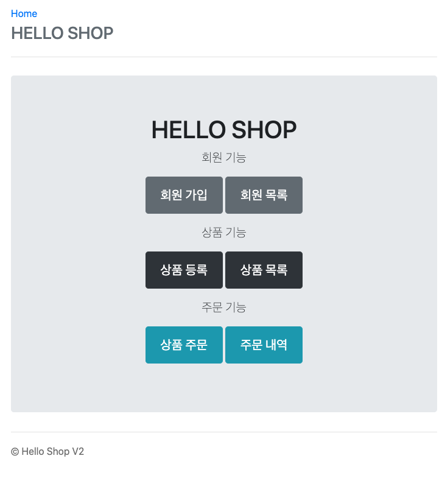
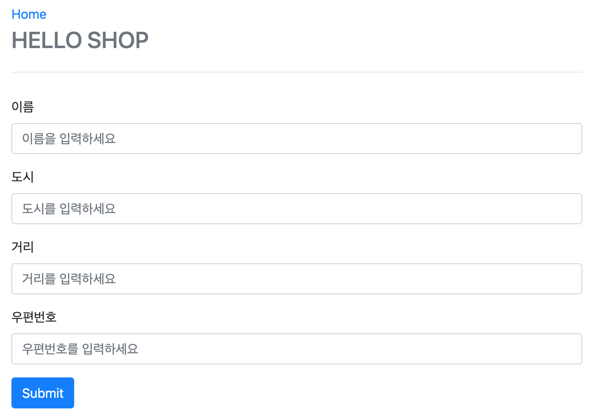
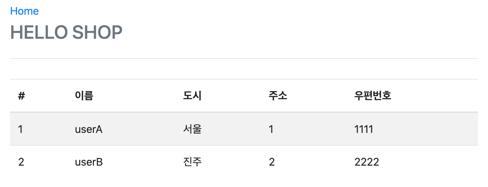
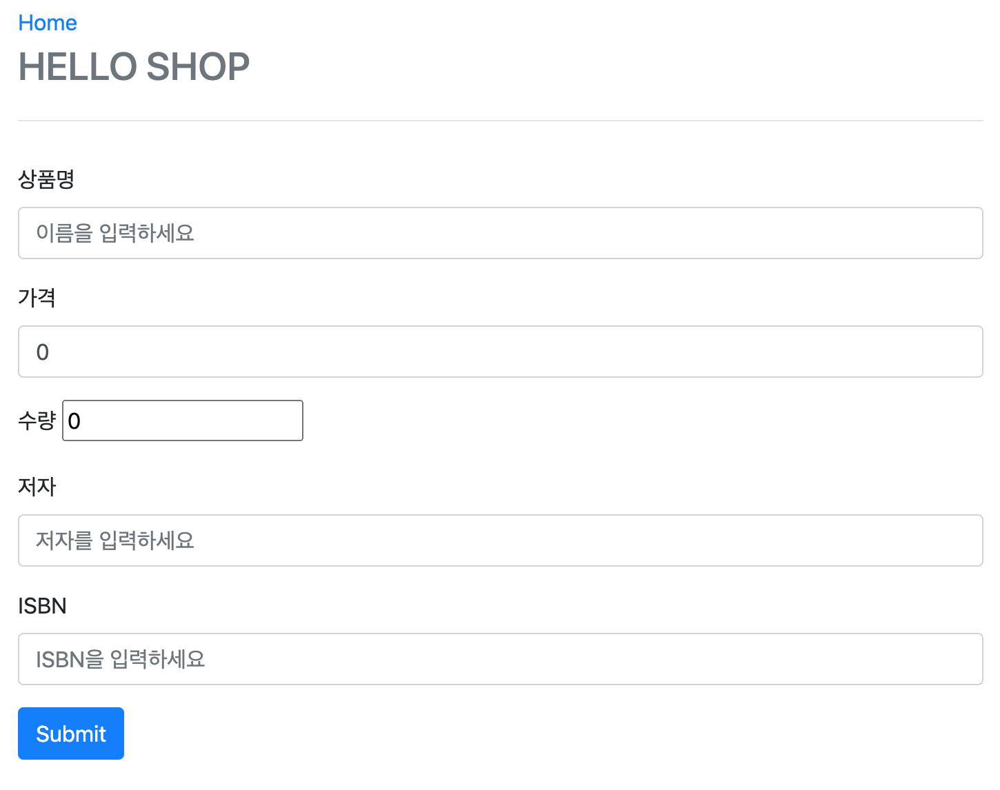
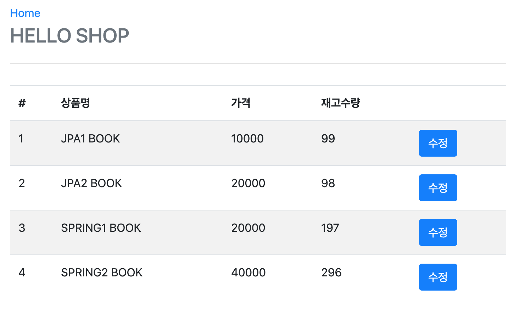
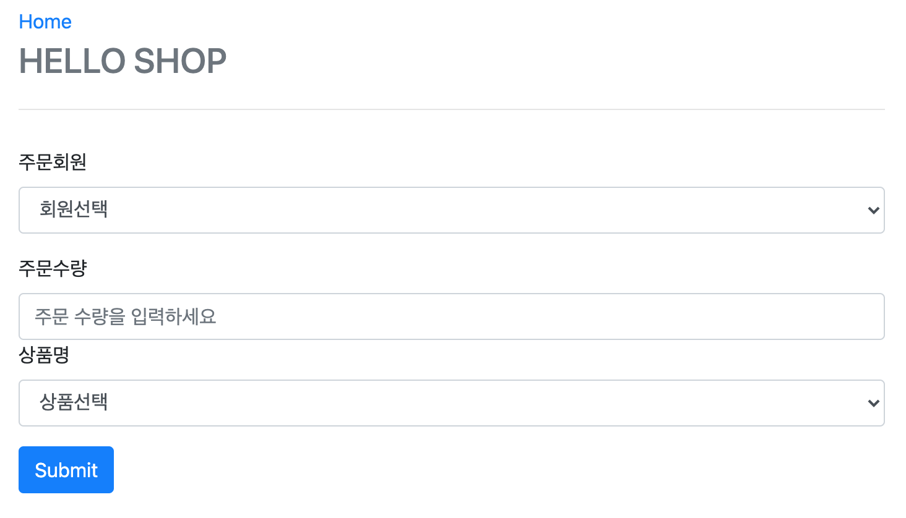
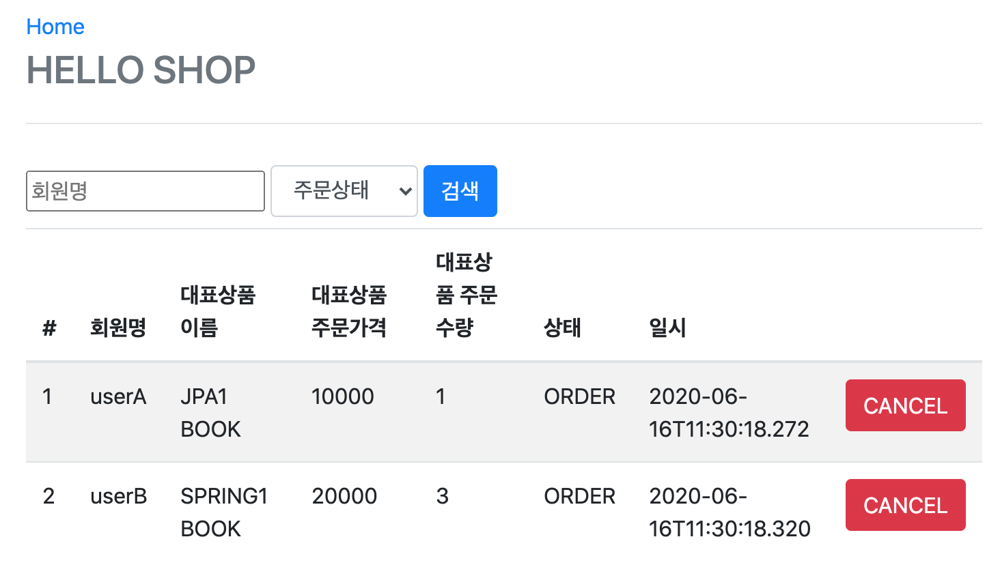

# 실전! 스프링 부트와 JPA 활용1 - 웹 애플리케이션 개발

<!--  -->

## 구현 순서

- 프로젝트 환경 설정
- [도메인 분석 설계](domain/README.md)
- 애플리케이션 구현 준비
- [회원 도메인 개발](member_domain/README.md)
- [상품 도메인 개발](item_domain/README.md)
- [주문 도메인 개발](order_domain/README.md)
- [웹 계층 개발](web_layer/README.md)

## 메인 페이지

## 회원 관련 기능

### 회원 추가(create)

### 회원 조회(read)

## 상품 관련 기능

### 상품 등록(create)

### 상품 조회 & 수정(read & update)

## 주문 관련 기능

### 상품 주문(create)

### 주문 내역(read & delete)
