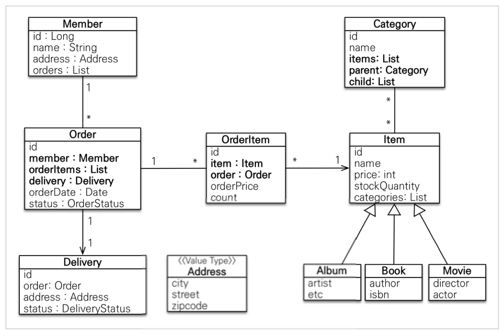

# 엔티티 설계하기

## 도메인 모델과 테이블 설계


- 회원과 상품의 관계 : 회원은 여러개의 상품을 주문할 수 있으므로 `일대다 관계`이다.
- 주문과 상품의 관계 : 한번에 여러개의 상품을 주문할 수 있고 하나의 상품이 여러 주문에 포함될 수 있으므로 `다대다 관계`이다.

>하지만, 다대다 관계는 관계형 데이터베이스는 물론이고 엔티티에서도 거의 사용하지 않는다. 따라서 그림처럼 주문 상품이라는 엔티티를 추가해 다대다 관계를 일대다, 다대일 관계로 풀어냈다.

## 회원 엔티티 분석



- Member
  - name
  - address(Embeded Type)
  - orders : 여러개를 주문할 수 있으므로 List형태의 값을 가진다.

- Order 
  - orderItem : 한번 주문시 여러 상품을 주문할 수 있으므로 일대다 관계를 갖는다.
  - member : 상품을 주문한 회원에 관한 정보
  - delivery : 배송정보
  - orderDate : 주문 날짜
  - status : 주문 상태

- OrderItem
  - orderPrice : 주문한 상품 정보와 주문 금액
  - count : 주문 수량

- Item
  - name : 이름
  - price : 가격
  - stockQuantity : 재고수량
  - 또한 상품의 종류로는 도서, 음반, 영화있다.

- Delivery
  - 주문시 하나의 배송 정보를 생성한다.
  - order : 주문과 배송은 일대일 관계를 갖는다.

- Category
  - items : 상품과는 다대다 관계를 맺는다.

- Address
  - 값타임(임베디드 타입)
  - 회원과 배송에서 사용이 된다.

## 회원 테이블 분석


> 회원 엔티티

```java
@Entity
@Getter
@Setter
public class Member {
    @Id
    @GeneratedValue(strategy = GenerationType.IDENTITY)
    @Column(name = "member_id")
    private Long id;

    private String name;

    @Embedded
    private Address address;

    @OneToMany(mappedBy = "member")
    private List<Order> orders = new ArrayList<>();
}
```

#### Member
| 클래스      | field명               | 설명                                                |
| ----------- | --------------------- | --------------------------------------------------- |
| String      | name                  | 회원 이름을 저장                                    |
| Address     | address(Embeded Type) | 주소를 저장하기 위한 Address 객체                   |
| List<Order> | orders                | 여러개를 주문할 수 있으므로 List형태의 값을 가진다. |

> 주문 엔티티

```java
@Entity
@Table(name = "orders")
@Getter
@Setter
@NoArgsConstructor(access = AccessLevel.PROTECTED)
public class Order {

    @Id
    @GeneratedValue(strategy = GenerationType.IDENTITY)
    @Column(name = "order_id")
    private Long id;

    @ManyToOne(fetch = FetchType.LAZY)
    @JoinColumn(name = "member_id")
    private Member member; //주문 회원

    @OneToMany(mappedBy = "order", cascade = CascadeType.ALL)
    private List<OrderItem> orderItems = new ArrayList<>();

    @OneToOne(cascade = CascadeType.ALL, fetch = FetchType.LAZY)
    @JoinColumn(name = "delivery_id")
    private Delivery delivery; //배송정보

    private LocalDateTime orderDate; //주문시간

    @Enumerated(EnumType.STRING)
    private OrderStatus status; //주문상태 [ORDER, CANCEL]

    //==연관관계 메서드==//
    public void setMember(Member member) {
        this.member = member;
        member.getOrders().add(this);
    }

    public void addOrderItem(OrderItem orderItem) {
        orderItems.add(orderItem);
        orderItem.setOrder(this);
    }

    public void setDelivery(Delivery delivery) {
        this.delivery = delivery;
        delivery.setOrder(this);
    }


    //==생산 메서드==//
    public static Order createOrder(Member member, Delivery delivery, OrderItem... orderItems) {
        Order order = new Order();
        order.setMember(member);
        order.setDelivery(delivery);
        for (OrderItem orderItem : orderItems) {
            order.addOrderItem(orderItem);
        }

        order.setStatus(OrderStatus.ORDER);
        order.setOrderDate(LocalDateTime.now());
        return order;
    }

    //==비즈니스 로직==//

    /**
     * 주문 취소
     **/
    public void cancel() {
        if (delivery.getStatus() == DeliveryStatus.COMP) {
            throw new IllegalStateException("이미 배송완료된 상품은 취소가 불가능 합니다.");
        }

        this.setStatus(OrderStatus.CANCEL);
        for (OrderItem orderItem : orderItems) {
            orderItem.cancel();
        }
    }

    //==조회 로직==//
    public int getTotalPrice() {
        int totalPrice = 0;
        for (OrderItem orderItem : orderItems) {
            totalPrice += orderItem.getTotalPrice();
        }
        return totalPrice;
    }
}
```

#### `Order`클래스
| 클래스          | field명    | 설명                                       |
| --------------- | ---------- | ------------------------------------------ |
| Member          | member     | 주문한 회원을 담을 수 있는 Member객체      |
| List<OrderItem> | orderItems | 주문한 item들을 담기 위한 List             |
| Delivery        | delivery   | 배송 정보를 담기 위한 delivery객체,        |
| LocalDateTime   | orderDate  | 주문한 시간을 담기 위한 LocalDateTime 객체 |
| OrderStatus     | status     | 주문한 상태를 담기 위한 OrderStatus 객체   |

> 주문 상태

```java
public enum OrderStatus {
    ORDER, CANCEL
}
```

> 주문 상품 엔티티

```java
@Entity
@Getter
@Setter
@NoArgsConstructor(access = AccessLevel.PROTECTED)
public class OrderItem {

    @Id
    @GeneratedValue(strategy = GenerationType.IDENTITY)
    @Column(name = "order_item_id")
    private Long id;

    @ManyToOne(fetch = FetchType.LAZY)
    @JoinColumn(name = "item_id")
    private Item item;      //주문 상품

    @ManyToOne(fetch = FetchType.LAZY)
    @JoinColumn(name = "order_id")
    private Order order;    //주문

    private int orderPrice; //주문 가격

    private int count;      //주문 수량


    //==생성 메서드==//
    public static OrderItem createOrderItem(Item item, int orderPrice, int count) {
        OrderItem orderItem = new OrderItem();
        orderItem.setItem(item);
        orderItem.setOrderPrice(orderPrice);
        orderItem.setCount(count);

        item.removeStock(count);
        return orderItem;
    }

    //==비즈니스 로직==//

    /**
     * 주문 취소
     **/
    public void cancel() {
        getItem().addStock(count);
    }

    //==조회 로직==//

    /**
     * 주문 상품 전체 가격 조회
     **/
    public int getTotalPrice() {
        return getOrderPrice() * getCount();
    }
}
```

#### OrderItem 클래스
| 클래스 | field명    | 설명                                    |
| ------ | ---------- | --------------------------------------- |
| Item   | item       | 상품을 담기 위한 Item 객체              |
| Order  | order      | 주문에 대한 정보를 담기 위한 Order 객체 |
| int    | orderPrice | 주문 가격을 담기 위한 orderPrice        |
| int    | count      | 주문 갯수를 담기 위한 field             |


> 상품 엔티티(추상 클래스)

```java
@Entity
@Getter
@Inheritance(strategy = InheritanceType.SINGLE_TABLE)
@DiscriminatorColumn(name = "dtype")
@Setter
public abstract class Item {

    @Id
    @GeneratedValue(strategy = GenerationType.IDENTITY)
    @Column(name = "item_id")
    private Long id;

    private String name;

    private int price;

    private int stockQuantity;

    @ManyToMany(mappedBy = "items")
    private List<Category> categories = new ArrayList<Category>();


    //==비즈니스 로직==//
    // stock 증가
    public void addStock(int quantity) {
        this.stockQuantity += quantity;
    }

    // stcok 감소
    public void removeStock(int quantity) {
        int restStock = this.stockQuantity - quantity;
        if (restStock < 0) {
            throw new NotEnoughStockException("need more stock");
        }
        this.stockQuantity = restStock;
    }
}
```

#### Item
| 클래스         | field명       | 설명                                             |
| -------------- | ------------- | ------------------------------------------------ |
| String         | name          | 상품 이름                                        |
| int            | price         | 상품 가격                                        |
| int            | stockQuantity | 재고수량                                         |
| List<Category> | categories    | 상품이 가지고 있는 카테고리를 저장하기 위한 List |


> 상품-도서 엔티티

```java
@Entity
@Getter
@Setter
@DiscriminatorValue("B")
public class Book extends Item {

    private String author;
    private String isbn;
}
```

> 상품-음반 엔티티
```java
@Entity
@Getter
@Setter
@DiscriminatorValue("A")
public class Album extends Item {
    private String artist;
    private String etc;
}
```

> 상품-영화 엔티티

```java
@Entity
@Getter
@Setter
@DiscriminatorValue("M")
public class Movie extends Item {
    private String artist;
    private String actor;
}
```

> 배송 엔티티

```java
@Entity
@Getter
@Setter
public class Delivery {

    @Id
    @GeneratedValue(strategy = GenerationType.IDENTITY)
    @Column(name = "delivery_id")
    private Long id;

    @OneToOne(mappedBy = "delivery", fetch = FetchType.LAZY)
    private Order order;

    @Embedded
    private Address address;

    @Enumerated(EnumType.STRING)
    private DeliveryStatus status;
}
```

#### Delivery
| 클래스         | field명 | 설명                                         |
| -------------- | ------- | -------------------------------------------- |
| Order          | order   | 주문과 배송은 일대일 관계를 갖는다.          |
| Address        | address | 배송을 위한 주소를 저장하기 위한 Address객체 |
| DeliveryStatus | status  | 배송 상태를 저장하기 위한 enums 객체         |

> 배송 상태 엔티티

```java
public enum  DeliveryStatus {
    READY, COMP
}
```
`DeliveryStatus`는 두가지 상태를 갖는다.
- READY
- COMP


> 카테고리 엔티티

```java
@Entity
@Getter
@Setter
public class Category {

    @Id
    @GeneratedValue(strategy = GenerationType.IDENTITY)
    @Column(name = "category_id")
    private Long id;

    private String name;
    @ManyToMany
    @JoinTable(name = "category_item",
            joinColumns = @JoinColumn(name = "category_id"),
            inverseJoinColumns = @JoinColumn(name = "item_id"))
    private List<Item> items = new ArrayList<>();

    @ManyToOne(fetch = FetchType.LAZY)
    @JoinColumn(name = "parent_id")
    private Category parent;

    @OneToMany(mappedBy = "parent")
    private List<Category> child = new ArrayList<>();

    //==연관관계 메서드==//
    public void addChildCategory(Category child) {
        this.child.add(child);
        child.setParent(this);
    }

}
```

#### Category
| 클래스         | field명 | 설명                                                  |
| -------------- | ------- | ----------------------------------------------------- |
| String         | name    | 카테고리 이름을 저장                                  |
| List<Item>     | items   | 한 카테고리가 가지고 있는 item들을 저장하기 위한 List |
| Category       | parent  | 상위 카테고리를 저장                                  |
| List<Category> | child   | 하위 카테고리를 저장하기 위한 List                    |
 


> 주소 값

```java
@Embeddable
@Getter
public class Address {

    private String city;
    private String street;
    private String zipcode;

    protected Address() {
    }

    public Address(String city, String street, String zipcode){
        this.city = city;
        this.street = street;
        this.zipcode = zipcode;
    }
}
```

`Address`
| 클래스 | field명 | 설명             |
| ------ | ------- | ---------------- |
| String | city    | 도시를 저장      |
| String | street  | 거리를 저장      |
| String | zipcode | 우편 번호를 저장 |