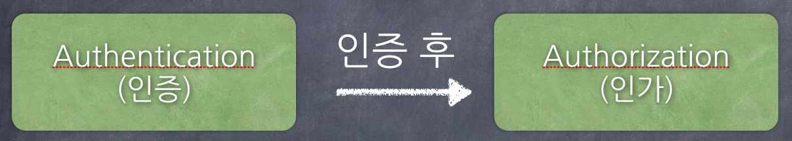
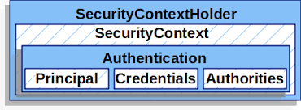

# SecurityContextHolder & Authentication

## 인증기반
- credential 기반 : 사용자 id와 password를 이용하여 인증하는 방식
- 이중 인증(two factor) : 사용자가 입력한 정보로 인증을 한 후, 다른 인증 체제를 이용하여 두 번 인증하는 방식
- 하드웨어 인증 : 물리적인 키와 같은 것을 이용하여 인증하는 방식

### 스프링에서의 인증

> 스프링에서는 credential기반 인증을 취한다.

- principal : 사용자의 아이디를 저장한다.
- credential : 사용자의 패스워드를 저장한다.

## 인증과 인가

> Authentication(인증 절차)을 거친 후 Authorization(인가 절차)를 진행한다.

- 인증 : 해당 사용자가 본인이 맞는지 확인한다.
- 인가 : 인증된 사용자가 요청한 자원에 접근이 가능한지 결정하는 절차

## 

## SecurityContextHolder & SecurityContext & Authentication

1. 사용자가 아이디/패스워드와 같은 사용자 정보를 넣고 실제 사용자 인지 체크한 후 인증에 성공하면 사용자의 `principal`과 `credential`정보를 `Authentication`에 저장을 한다.
2. `SpringSecurity`에서는 Authentication을 SecurityContext에 보관을 한다.
3. 이 SecurityContext를  `SecurityContextHolder`에 담아 보관하게 된다.

### Authentication

> 인증 정보를 의미하는 인터페이스

## 참고 사이트
- https://minwan1.github.io/2017/03/25/2017-03-25-spring-security-theory/
