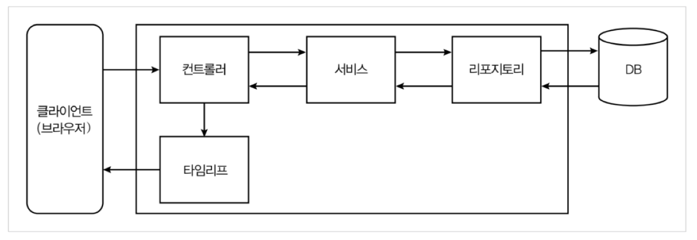

# 스프링 부트 웹 만들기

1. [domain 생성하기](template/README.md)
2. [repository 만들기](repository/README.md)
3. [service 만들기](service/README.md)
4. [controller 만들기](controller/README.md)
5. [CommandLineRunner를 사용해 DB에 데이터 넣기](commandlinerunner/README.md)
6. [template만들기](template/README.md)

## 게시판의 MVC 모델

## 커뮤니티 게시판 기능 설계도

간단하 CRUD 기능만을 제공하는 게시판 구현