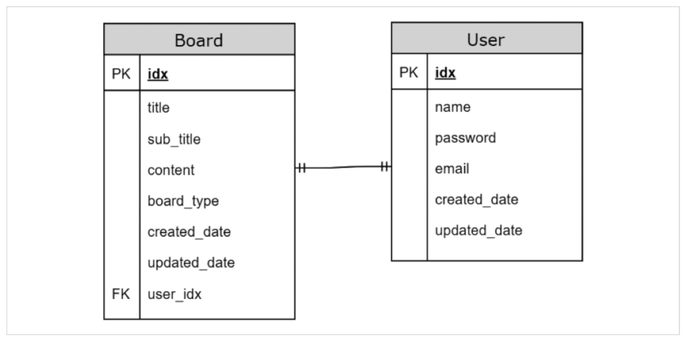
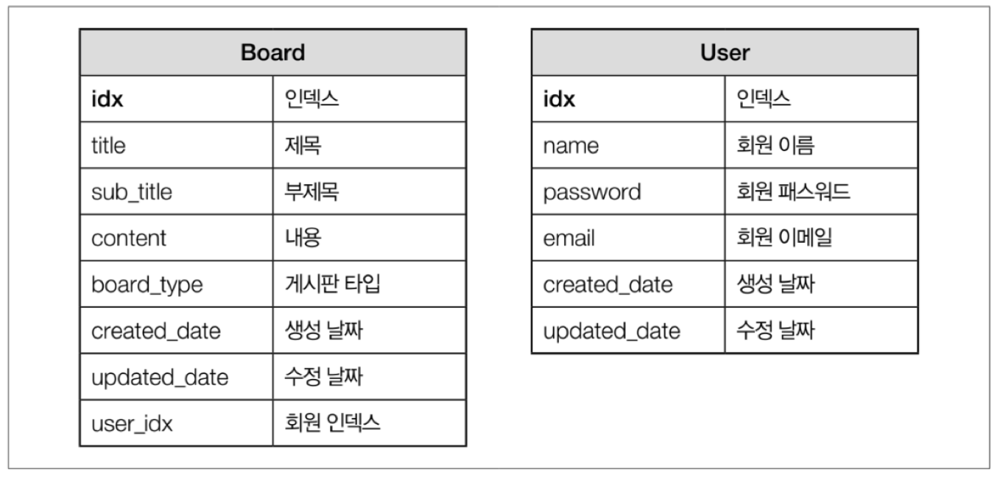

# domain 생성하기

## 커뮤니티 게시판 엔티티 관계도


## 커뮤니티 게시판 데이터베이스 테이블


> Board Entity 생성하기

```java
@Entity
@Table
@NoArgsConstructor
@Getter
public class Board {
    @Id
    @GeneratedValue(strategy = GenerationType.IDENTITY)
    private Long idx;
    @Column
    private String title;
    @Column
    private String subTitle;
    @Column
    private String content;
    @Column
    @Enumerated(EnumType.STRING)
    private BoardType boardType;
    @Column
    private LocalDateTime createdDate;
    @Column
    private LocalDateTime updatedDate;
    @OneToOne(fetch = FetchType.LAZY)
    private User user;

    @Builder
    public Board(String title, String subTitle, String content, BoardType boardType, LocalDateTime createdDate,
            LocalDateTime updatedDate, User user) {
        this.title = title;
        this.subTitle = subTitle;
        this.content = content;
        this.boardType = boardType;
        this.createdDate = createdDate;
        this.updatedDate = updatedDate;
        this.user = user;
    }
}
```

> BoardType

```java
public enum BoardType {
    notice("공지사항"), free("자유게시판");

    private String value;

    BoardType(String value) {
        this.value = value;
    }

    public String getValue() {
        return value;
    }
}
```

> User Entity

```java
@Entity
@Table
@NoArgsConstructor
@Getter
public class User {
    @Id
    @GeneratedValue(strategy = GenerationType.IDENTITY)
    private Long idx;
    @Column
    private String name;
    @Column
    private String password;
    @Column
    private String email;
    @Column
    private String pincipal;
    @Column
    private LocalDateTime createdDate;
    @Column
    private LocalDateTime updatedDate;

    @Builder
    public User(String name, String password, String email, String pincipal, LocalDateTime createdDate,
            LocalDateTime updatedDate) {
        this.name = name;
        this.password = password;
        this.email = email;
        this.pincipal = pincipal;
        this.createdDate = createdDate;
        this.updatedDate = updatedDate;
    }
}
```