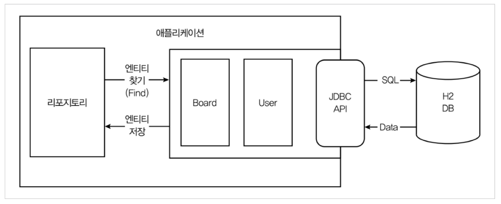

# repository 만들기

## JPA를 활용한 H2 DB 매핑 구성도


> BoardRepository

```java
public interface BoardRepository extends JpaRepository<Board, Long> {
    Board findByUser(User user);
}
```

> UserRepository

```java
public interface UserRepository extends JpaRepository<User, Long> {
    User findByEmail(String email);
}
```