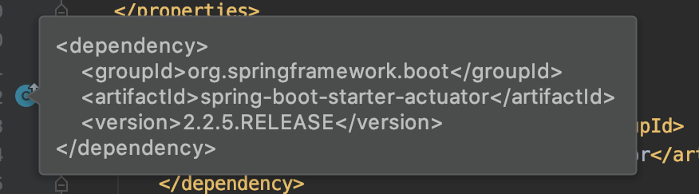
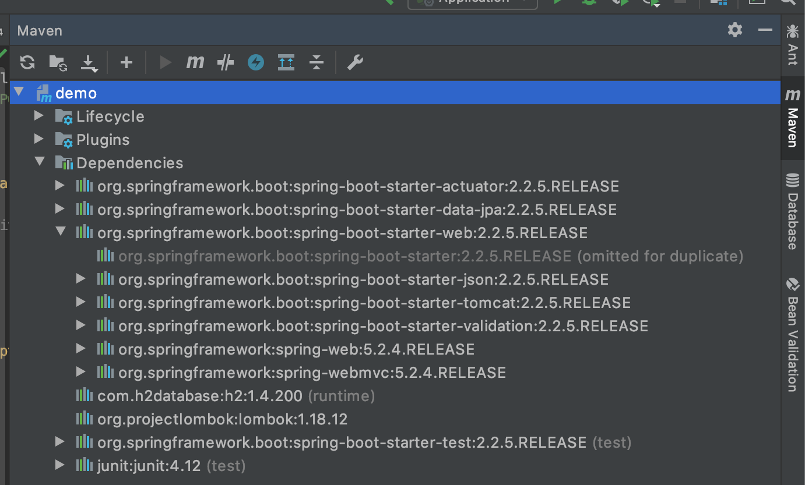

# Spring Boot의 의존성


## pom.xml파일에 의존성 추가
```xml
<dependency>
    <groupId>org.springframework.boot</groupId>
    <artifactId>spring-boot-starter-web</artifactId>
</dependency>
```
스프링이 제공하는 `의존성 관리 기능` 덕분에  
의존성 정의시 `version`을 따로 명시하지 않아도 적절한 `version`을 가져온다.



## 의존성 상속 관계

### spring-boot-starter-parent

```xml
<parent>
    <groupId>org.springframework.boot</groupId>
    <artifactId>spring-boot-starter-parent</artifactId>
    <version>2.2.5.RELEASE</version>
    <relativePath/> <!-- lookup parent from repository -->
</parent>
```

### spring-boot-dependencies

```xml
<parent>
    <groupId>org.springframework.boot</groupId>
    <artifactId>spring-boot-dependencies</artifactId>
    <version>2.2.5.RELEASE</version>
    <relativePath>../../spring-boot-dependencies</relativePath>
</parent>

...
<dependencyManagement>
    <dependencies>
      <dependency>
...
```

`spring-boot-starter-parent` -> `spring-boot-dependencies`로 가게 되면  
`dependencyManagement`태그를 통해 스프링 부트에서 관리하는 `의존성`과 `version`들을 확인할 수 있다.

`spring-boot-dependencies`라는 pom안에 정의 되어 있는 것들 중에 하나라도 쓰게 된다면  
직접 version을 명시하지 않아도 된다.  

dependencyManagement 기능이 있어서 수 많은 Library들이 들어오게 된다.  
__따라서, 우리가 관리해야 할 의존성의 수가 줄어든다.__

## dependency 확인
 


`Maven Projects Tab`에서 `dependency`들을 쉽게 볼 수 있다.

## 의존성 추가

`starter` 위주로 의존성을 추가하며 된다.  
만약 `pom`에서 지원하지 않는 의존성 추가시 version까지 명시해 주어야 한다.
springboot dependency에서 관리하는 의존성은 굳이 version을 명시하지 않아도 되나 특별히 원하는 version이 있으면 version을 명시해 주면 `override(덮어쓰기)`가 된다.

## springboot 의존성 관리

`<parent>`를 통해서 의존성을 관리해준다. 만약, 해당 프로젝트에서 parent.pom을 사용하지 않을 경우

1. project가 상속하는 parent에 `spring-boot-starter-parent`를 상속하는 방법
2. `<dependencyManagement>`색션을 사용하는 방법

`<dependecyManagement>`를 사용하게 되면 문제점이 생기는데,  
spring-boot-starter-parent가 단순히 의존성만을 가져오는 것이 아닌 여러가지 설정들을 함께 가져 오기 때문이다. 
> ex) 자바 버전, 문자 인코딩 방식, resource(스프링 부트가 사용하는 properties와 yaml파일들)과 spring-boot를 최정화 시켜주는 여러가지 설정들

