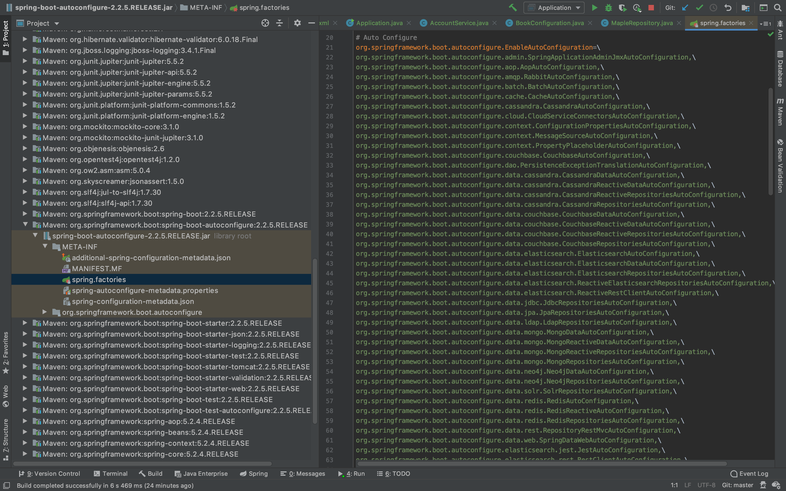

# 자동 설정 이해

@SpringBootApplication은 크게 3가지 어노테이션으로 이루어져 있다.
1. @SpringBootConfiguration
2. @ComponentScan
3. @EnableAutoConfiguration

`@SpringBootConfiguration`은 기존의 `Configuration`과 비슷하다.  
`@ComponentScan`에서 1차적으로 @Bean을 읽어들인 후 `@EnableAutoConfiguration`에서 2차적으로 @Bean을 읽어들인다.

> 즉 springboot는 Bean을 두번 등록하는 작업을 거친다.


## EnableAutoConfiguration

스프링부트에서 EnableAutoConfiguration이 없어도 작동은 하지만 문제가 생긴다.

```java
@SpringBootConfiguration
@ComponentScan
//@EnableAutoConfiguration
public class Application {

    public static void main(String[] args) {
        SpringApplication.run(Application.class, args);
    }
}
```

### 오류코드
>Caused by: org.springframework.context.ApplicationContextException: Unable to start ServletWebServerApplicationContext due to missing ServletWebServerFactory bean.

스프링부트는 코드를 웹 어플리케이션 형태로 제작하는데, 웹 어플리케이션으로 만드는 과정에서 `EnableAutoConfiguration`에서 읽어들어들이는 `ServletWebServerFactory bean`을 사용하기 때문에 문제가 생기게 된다.  

`SpringApplication.run()`을 바로 사용하게 되면 웹 어플리케이션 형태로 작동을 한다.
`EnableAutoConfiguration`없이는 웹 어플리케이션으로 만드는 것이 불가능 하므로
바로 사용할 수 없다.

## 웹 어플리케이션 설정 꺼주기
```java
@SpringBootConfiguration
@ComponentScan
//@EnableAutoConfiguration
public class Application {

    public static void main(String[] args) {
        // SpringApplication.run(Application.class, args);

        // SpringApplication 인스턴스를 생성하면 커스터마이징 해서 사용이 가능하다.
        SpringApplication application = new SpringApplication(Application.class);
        // webApplication만드는 설정을 꺼준다.
        application.setWebApplicationType(WebApplicationType.NONE);
        application.run(args);

    }
}
```
`SpringApplication` 인스턴스를 생성한 후에 `setWebApplicationType()`메소드를 이용하여 `WebApplicationType.NONE`인자 값을 넘겨주면 webApplication으로 만들어 주는 설정을 끌 수 있다. 작동은 가능하나 웹 어플리케이션으로 작동하지는 않는다.

## @ComponentScan

<image src="picture/componentscan.png" width = 320/>


`@ComponentScan`은 Application.class에 있다. 위 그림에서는 a와 b 패키지의 경우는 ComponentScan의 대상이 되나 maple 패키지의 경우 ComponentScan의 대상이 되지 않는다. 

### @ComponentScan에서 Scan하는 것들
> @Component @Configuration @Repository @Service @Controller @RestController

위 어노테이션을 가진 class들을 scan하여 `Bean`으로 등록을 한다.  
`@ComponentScan`을 가진 class부터 시작하여 하위 package들을 scan해 위 어노테이션이 달려 있는 것들을 `Bean`으로 등록한다.
scan을 할 때는 `TypeExcludeFilter.class`와 `AutoConfigurationExcludeFilter.class`들을 제외하여 scan한다.


## @EnableAutoConfiguration



EnableAutoConfiguration은 springboot의 `META` file을 읽어 들인다.

### @ConditionalOnXxxYyyZzz
> @ConditionalOnWebApplication(type = Type.SERVLET)

웹 어플리케이션 타입에 따라 설정을 다르게 한다.

> @ConditionalOnMissingBean(HiddenHttpMethodFilter.class)

해당 Bean이 없으면 다른 것을 등록 한다.