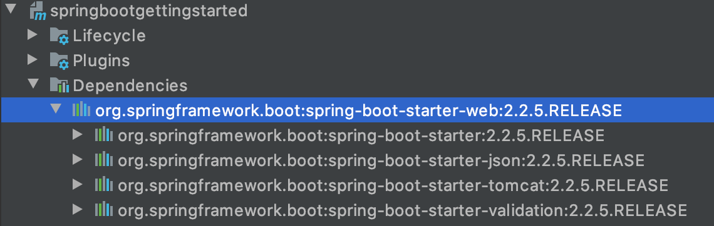
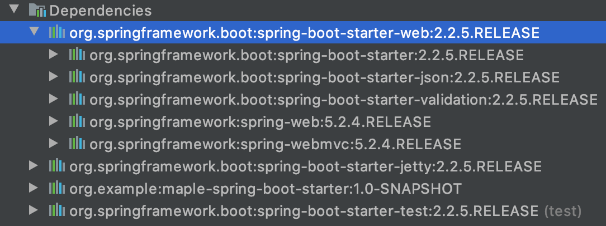

# 내장 웹 서버 응용 1부 : 컨테이너와 포트

https://docs.spring.io/spring-boot/docs/current/reference/html/howto-embedded-web-servers.html
에 다른 서블릿 컨테이너를 사용하는 방법이 적혀져 있다.

## tomcat 빼기


일단, spring-boot-starter-web에 적재되어 있는 tomcat을 뺄 필요가 있다.

```xml
<dependency>
    <groupId>org.springframework.boot</groupId>
    <artifactId>spring-boot-starter-web</artifactId>
    <exclusions>
        <exclusion>
            <groupId>org.springframework.boot</groupId>
            <artifactId>spring-boot-starter-tomcat</artifactId>
        </exclusion>
    </exclusions>
</dependency>
```

톰켓을 뺀 후 아무것도 추가하지 않으면 웹 어플리케이션으로 작동하지 않고 어플리케이션으로 작동하기 때문에 그냥 종료된다.

## 다른 컨테이너 추가하기

### Jetty

```xml
<dependency>
    <groupId>org.springframework.boot</groupId>
    <artifactId>spring-boot-starter-jetty</artifactId>
</dependency>
```

새로운 서블릿 컨테이너로 `jetty`를 추가해 주었다.



tomcat은 빠지고 jetty가 추가된 것을 볼 수 있다.

### 결과

```shell
Jetty started on port(s) 8080 (http/1.1) with context path '/'
```

스프링 부트를 실행해 보면 Jetty가 실행된 것을 볼 수 있다.

### undertow

```xml
<dependency>
    <groupId>org.springframework.boot</groupId>
    <artifactId>spring-boot-starter-undertow</artifactId>
</dependency>
```

다른 서블릿 컨테이너로 `undertow`를 추가해봤다.

## properties를 사용하는 방법

### 웹 어플리케이션 타입 끄기

> application.properties

```
spring.main.web-application-type=none
```

`spring.main.web-application-type`에 `none`을 주게 되면 의존성이 있다고 해도 none web-application으로 작동을 하고 실행하고 바로 끝내게 된다.

```shell

  .   ____          _            __ _ _
 /\\ / ___'_ __ _ _(_)_ __  __ _ \ \ \ \
( ( )\___ | '_ | '_| | '_ \/ _` | \ \ \ \
 \\/  ___)| |_)| | | | | || (_| |  ) ) ) )
  '  |____| .__|_| |_|_| |_\__, | / / / /
 =========|_|==============|___/=/_/_/_/
 :: Spring Boot ::        (v2.2.5.RELEASE)

2020-03-15 23:58:13.136  INFO 80825 --- [           main] com.example.Application                  : Starting Application on yangdong-uui-MacBookPro.local with PID 80825 (/Users/dongwoo-yang/dev/study/spring/everyday_spring/chapter3/ch3_7/springbootgettingstarted/target/classes started by dongwoo-yang in /Users/dongwoo-yang/dev/study/spring/everyday_spring/chapter3/ch3_7/springbootgettingstarted)
2020-03-15 23:58:13.139  INFO 80825 --- [           main] com.example.Application                  : No active profile set, falling back to default profiles: default
2020-03-15 23:58:13.724  INFO 80825 --- [           main] com.example.Application                  : Started Application in 0.919 seconds (JVM running for 1.529)

Process finished with exit code 0
```

바로 종료가 됨을 확인할 수 있다.

### 포트 변경 하기

> application.properties

```
server.port=7070
```

7070포트로 변경하였다.

### 결과

```
Undertow started on port(s) 7070 (http) with context path ''
```

8080(기본)포트에서 7070포트로 바뀐 것을 확인할 수 있따.

### 랜덤 포트

```
server.port=0
```

포트번호로 0을 주게 되면 비어있는 포트를 선택해서 만들어준다.

## 실시간으로 포트정보 알아보기

```java
@Component
public class PortListener implements ApplicationListener<ServletWebServerInitializedEvent> {
    @Override
    public void onApplicationEvent(ServletWebServerInitializedEvent event) {
        // getApplicationContext()메소드를 이용하여 ApplicationContext를 얻는다.
        // ApplicationContext는 servlet ApplicationContext이기 때문 웹 서버를 알 수 있다.
        ServletWebServerApplicationContext applicationContext = event.getApplicationContext();
        // 얻어진 웹서버를 통해 포트를 알아낼 수 있다.
        System.out.println(applicationContext.getWebServer().getPort());
    }
}
```

`ApplicationListner<ServletWebServerInitializedEvent>`인터페이스를 구현함으로써 포트번호를 알아 낼 수 있다.
`ApplicationListner<ServletWebServerInitializedEvent>`를 구현한 PortListener는 웹서버가 초기화가 되면 호출 된다.

이벤트 발생시 얻어진 `ServletWebServerInitializedEvent`인스턴스에 `getApplicationContext()`메소드를 이용하여 `ApplicationContext`객체를 얻어낼 수 있다. 얻어진 `ApplicationContext`객체는 `servlet ApplicationContext` 객체이므로 웹 서버를 알 수 있고 얻어진 웹 서버를 통해 포트를 알아낼 수 있다.
