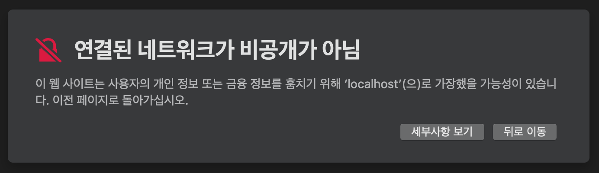

# 내장 웹 서버 응용 2부 : HTTPS와 HTTP2

https를 사용하기 위해서는 키스토어가 필요하다.

## 키스토어 생성

```shell
# 저는 줄 바꿈 문자 해결 했습니당 ^^
keytool -genkey \
  -alias tomcat \
  -storetype PKCS12 \
  -keyalg RSA \
  -keysize 2048 \
  -keystore keystore.p12 \
  -validity 4000
```

위 명령어를 사용하여 키 스토어를 생성할 수 있다.

```shell
키 저장소 비밀번호 입력:
새 비밀번호 다시 입력:
이름과 성을 입력하십시오.
  [Unknown]:  dongwoo yang
조직 단위 이름을 입력하십시오.
  [Unknown]:  island
조직 이름을 입력하십시오.
  [Unknown]:  ceo
구/군/시 이름을 입력하십시오?
  [Unknown]:  seongbuk
시/도 이름을 입력하십시오.
  [Unknown]:  seoul
이 조직의 두 자리 국가 코드를 입력하십시오.
  [Unknown]:  kr
CN=dongwoo yang, OU=island, O=ceo, L=seongbuk, ST=seoul, C=kr이(가) 맞습니까?
  [아니오]:  예
```

해당 질문들이 나오는데, 마지막에 "네" 혹은 "yes"를 하게 되면 무한루프에 빠지게 된다..... 예라고 꼭!!!! 적어주도록....

> key를 생성하게 된 다음에 git을 사용하고 있는 중이라면 꼭!!! gitignore에 추가하자!!!

## 키스토어 사용을 위한 세팅해주기

> application.properties

```java
server.ssl.key-store=keystore.p12
server.ssl.key-store-type=PKCS12
server.ssl.key-store-password=123456
server.ssl.key-alias=tomcat
```

위에 기입했던 내용하고 일치해야 한다 특히 `alias` 백기선 님이 `tomcat`이라 올려놓고 강의에는 spring이라고 해서 실행이 계속 안됬다...

> Application.java

```
@SpringBootApplication
@RestController
public class Application {

    @GetMapping("/hello")
    public String hello(){
        return "Hello Spring";
    }

    public static void main(String[] args) {
        SpringApplication.run(Application.class, args);
    }
}
```


localhost:8080으로 `http` 접속을 하게 되면 해당 결과를 받게 된다.
이제부터 우리는 `https`를 이용하여 접속해야 한다.



https://localhost:8080 형식으로 접속을 시도 하면 위의 문구가 뜨게 된다.(웹 브라우저마다 살짝 다르게 표시됨.) 이는 웹 브라우저가 `public키`를 가지고 있지 않기 때문에 이렇게 뜨는 것이다. 우리가 만든 인증서는 브라우저가 모르는 인증서이기 때문에 보안 문구가 뜨게 되는 것이다. (이젠 다음으로 넘어가는 것도 안되는 듯....)

### Curl 명령

```shell
curl -I -k --http2 https://localhost:8080/hello
```

### Get 요청해보기

```shell
curl -k -X GET --http2 https://localhost:8080/hello
```

curl 명령어를 이용해 터미널 환경에서도 반환 값을 확인 할 수 있다.

### 결과

```http
HTTP/1.1 200
Content-Type: text/plain;charset=UTF-8
Content-Length: 12
Date: Sun, 15 Mar 2020 16:50:14 GMT
```

`-I`에 대한 요청 정보로 해더를 보여준다.

```http
Hello Spring
```

`Get`요청에 대한 결과로 Hello Spring이 반환되었다.

## 커넥터 생성하기

https를 사용하게 되면 더 이상 http를 사용할 수 없게 된다. `HTTP 커넥터`가 한개인데, 그 커넥터에 ssl을 적용함으로써 HTTPS로 사용하고 있기 때문이다. 만약 HTTP도 사용하고 싶으면 `또 하나의 커넥터`를 만들어 주어야 한다.

> Application.java에 내용 추가

```java
......

@Bean
public ServletWebServerFactory serverFactory(){
    TomcatServletWebServerFactory tomcat = new TomcatServletWebServerFactory();
    tomcat.addAdditionalTomcatConnectors(createStandardConnector());
    return tomcat;
}

private Connector createStandardConnector(){
    Connector connector = new Connector("org.apache.coyote.http11.Http11NioProtocol");
    connector.setPort(8080);
    return connector;
}
```

> application.properties에 내용 추가

```
......

server.port=8443
```

HTTP연결의 경우 8080포트를 사용하게 되고, HTTPS연결의 경우는 8443포트를 사용하게 된다.

## HTTP2 활성화 하기

> application.properties에 내용 추가

```
...
server.http2.enabled=true
```

application.properties에 `http2`사용에 대한 설정을 추가해주고 각 servlet 컨테이너 마다 다른 설정을 해주어야 한다.
