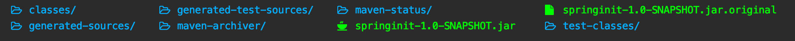

# 독립적으로 실행 가능한 JAR

앱을 어딘가에 배포하거나 도커 이미지로 만들거나 하기 위해서는 `jar`패키지로 패키징한 후 `jar`파일을 실행하는게 유용하다.

## jar파일 생성

```shell
mvn package
```

`mvn pakcage`명령어를 통해 앱을 jar파일로 생성한다.


`jar`파일이 생성됨을 확인할 수 있다. `jar`파일 안에는 앱을 실행하기 위한 의존성(library)들이 전부 다 포함되어 있다.

## jar 파일 실행

```shell
java -jar springinit-1.0-SNAPSHOT.jar
```

`java -jar`명령어를 통해 `jar`파일을 실행할 수 있다.
